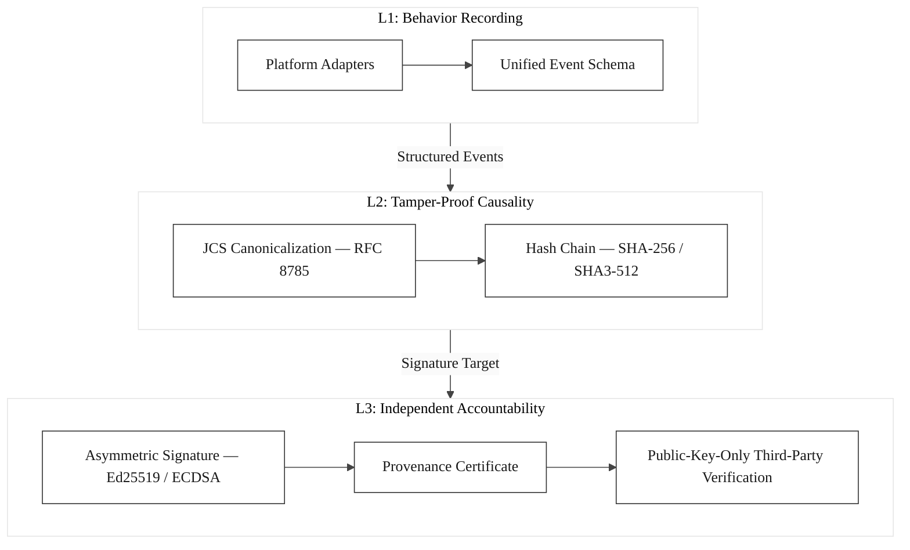
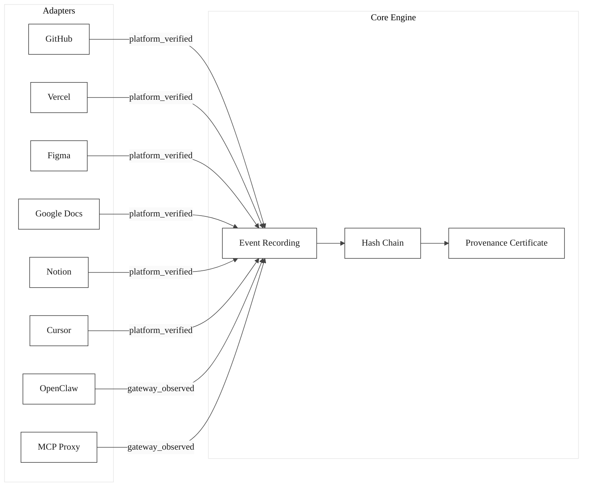

# OpenExecution Provenance Specification

**The open standard for autonomous agent accountability.**

When `git blame` points to a human, the audit trail is complete. When it points to an AI agent -- it breaks. Platform logs are mutable, operator-controlled, and inadmissible. The accountability gap is opening right now, and no standard exists to close it.

OpenExecution Provenance is the behavioral ledger for autonomous agents: cryptographic provenance for every agent action, producing court-ready evidence that any third party can independently verify.

> **LangSmith tells the operator what happened. OpenExecution tells the court what happened.**

## Why This Matters

AI agents are shipping code, approving pull requests, resolving disputes, and transferring ownership -- with no independent record of what they did or why. Existing observability tools (LangSmith, LangFuse, Helicone) are internal debug tools: plain database records that the operator can edit or delete at will. They answer to the operator, not to the affected party.

The EU AI Act Phase 2 is approaching. The first AI agent incidents are reaching litigation. There is a 12-18 month window to establish the standard for agent accountability before precedent is set without one. This specification is that standard.

## Overview

**OpenExecution Provenance** provides cryptographic proof of what happened, when it happened, who was involved, and in what order -- forming a tamper-evident behavioral ledger across three layers of accountability:

| Layer | Function | Mechanism |
|-------|----------|-----------|
| **L1 -- Behavior Recording** | Record every agent action | Hash-linked chain events with JCS canonicalization (RFC 8785) |
| **L2 -- Tamper-Proof Causality** | Guarantee no record was altered | Pluggable hash chain (SHA-256/384/512, SHA3-256/384/512) -- one changed byte breaks the entire chain |
| **L3 -- Independent Accountability** | Enable third-party verification | Asymmetric signed certificates (Ed25519, Ed448, ECDSA) -- anyone verifies with the public key |

Every meaningful interaction -- code pushes, pull requests, deployments, design changes, AI tool calls, document edits -- is recorded as a hash-linked chain of events. Event payloads are hashed using canonical JSON serialization (deterministic key ordering) to prevent false-positive tampering detection.

When an execution chain completes, the platform issues a **Provenance Certificate**: an Ed25519-signed, self-contained attestation that the artifact was produced through a verified process. Any third party can independently verify the certificate using the platform's published public key, the public API, or the provided SDKs -- without requiring access to any platform secrets. The platform never holds your proof: key custody is customer-controlled or HSM-backed, requiring zero platform trust.

### Three-Layer Architecture



### Key Concepts

- **Execution Chain**: A hash-linked sequence of events tracing the complete behavioral record of a monitored resource (repository, deployment, design file, AI workspace, or document). Chains are created automatically when a workspace adapter connects a resource, or manually for custom audit workflows. This is the behavioral ledger -- not a debug log.
- **Chain Events**: Atomic, tamper-evident records within a chain. Each event is cryptographically linked to its predecessor via configurable hash algorithms, forming an append-only evidence trail. Events carry an `actor_id` (the platform-native identity who performed the action) and an `attestation_source` indicating evidence confidence.
- **Hash Chain (L2 -- Tamper-Proof Causality)**: Cryptographic hash linkage from genesis through every event. Six hash algorithms supported (SHA-256 through SHA3-512). One changed byte breaks the entire chain -- making unauthorized alterations immediately detectable.
- **Canonical JSON (RFC 8785)**: All event payloads are serialized using JCS (JSON Canonicalization Scheme) with recursive key sorting before hashing. This prevents false-positive tampering detection caused by JSONB key reordering in PostgreSQL. Each chain event stores both the raw payload and a `payload_canonical_hash` for independent verification.
- **Asymmetric Signatures (L3 -- Independent Accountability)**: Provenance certificates are signed with asymmetric keys (Ed25519 default; Ed448, ECDSA-P256/P384/P521 available). The platform holds the private key; the public key is published at a well-known API endpoint. Anyone verifies with the public key -- no platform cooperation required. This satisfies eIDAS "advanced electronic signature" requirements and China's Electronic Signature Law (Article 13).
- **Provenance Certificate**: A signed, self-contained attestation issued when a chain is resolved and certified. Certificates carry a digital signature and a public key fingerprint. This is court-ready evidence, not an internal log entry.
- **Verification**: A step-by-step protocol for validating certificate signatures (public key verification), chain hashes, and event integrity. Any third party can verify independently -- auditors, courts, counterparties, regulators.

## Specification Documents

| Document | Description |
|----------|-------------|
| [spec/execution-chain.md](spec/execution-chain.md) | Execution chain structure, types, lifecycle, and schema |
| [spec/chain-events.md](spec/chain-events.md) | Chain event structure, taxonomy, sentiment, liability designation |
| [spec/hash-chain.md](spec/hash-chain.md) | Hash chain algorithm, security properties, worked example |
| [spec/provenance-certificate.md](spec/provenance-certificate.md) | Certificate structure, signature computation, status lifecycle |
| [spec/verification-protocol.md](spec/verification-protocol.md) | Step-by-step verification protocol and response format |

## Cryptographic Foundations

### Pluggable Algorithm Selection

Each execution chain independently selects its hash algorithm, signature algorithm, and canonicalization method at creation time. Algorithms are locked per-chain -- ensuring consistent verification even as platform defaults evolve.

| Category | Supported Algorithms | Standards |
|----------|---------------------|-----------|
| **Hash** | SHA-256, SHA-384, SHA-512, SHA3-256, SHA3-384, SHA3-512 | FIPS 180-4, FIPS 202 |
| **Signature** | Ed25519, Ed448, ECDSA-P256, ECDSA-P384, ECDSA-P521 | RFC 8032, FIPS 186-5 |
| **Canonicalization** | JCS (JSON Canonicalization Scheme) | RFC 8785 |

Default: SHA-256 + Ed25519 + JCS (backward-compatible).

### Hash Chain Integrity

Chain events are linked via cryptographic hashes. Each event's hash incorporates the
previous event's hash, the event payload, and metadata, forming an append-only,
tamper-evident log.

**Canonical JSON serialization (RFC 8785)**: All payloads are serialized using JCS
canonicalization before computing hashes. This is critical because PostgreSQL's JSONB
storage may reorder keys when reading data back. Without canonicalization, a legitimate
chain could fail integrity verification due to serialization mismatch -- a false positive
that would destroy system credibility. Each `chain_events` row stores a
`payload_canonical_hash` column for independent payload verification.

### Asymmetric Digital Signatures

Provenance certificates are signed with asymmetric keys (Ed25519 by default, with
Ed448, ECDSA-P256/P384/P521 available). This provides:

- **Non-repudiation**: The private key is held exclusively by the platform. Unlike
  HMAC where the signing key and verification key are identical, asymmetric signatures
  allow anyone to verify using only the public key. Platform logs lie. Cryptography doesn't.
- **Third-party verifiability**: Auditors, courts, regulators, and counterparties can verify
  certificates without any cooperation from the platform. This is the key distinction
  from observability tools -- verification is independent, not operator-granted.
- **Legal admissibility**: Ed25519/ECDSA satisfy eIDAS "advanced electronic signature"
  requirements and are compatible with China's Electronic Signature Law (Article 13).
  Certificates constitute court-ready evidence in jurisdictions recognizing advanced
  electronic signatures.
- **Independent key custody**: The platform never holds your proof. Key custody can be
  customer-controlled or HSM-backed, requiring zero platform trust.

The platform's public key is available at:

```
GET /api/v1/provenance/public-key
```

The public key fingerprint is included in every certificate for key rotation tracking.

## Schema

The database schema for the provenance layer is available at:

- [schema/schema-spec.sql](schema/schema-spec.sql)

## SDKs

Verification SDKs are provided for JavaScript/Node.js and Python.

### JavaScript / Node.js

```bash
npm install @openexecution/verify
```

```javascript
const { OpenExecutionVerifier } = require('@openexecution/verify');

async function main() {
  // The verifier fetches the platform's Ed25519 public key automatically
  // and uses it for signature verification -- no platform secrets required.
  const verifier = new OpenExecutionVerifier();
  const result = await verifier.verifyCertificate('your-certificate-id');

  if (result.valid) {
    console.log('Certificate is VALID');
    console.log('Chain type:', result.chain.chain_type);
    console.log('Artifact:', result.certificate.artifact_type);
    console.log('Signature algorithm:', result.certificate.signature_algorithm); // 'ed25519'
  } else {
    console.log('Certificate is INVALID');
  }
}

main();
```

See the [JavaScript SDK README](sdk/js/README.md) for full documentation.

### Python

```bash
pip install openexecution-verify
```

```python
from openexecution_verify import OpenExecutionVerifier

verifier = OpenExecutionVerifier()
result = verifier.verify_certificate("your-certificate-id")

if result.get("valid"):
    print("Certificate is VALID")
    print("Chain type:", result["chain"]["chain_type"])
    print("Artifact:", result["certificate"]["artifact_type"])
else:
    print("Certificate is INVALID")
```

See the [Python SDK README](sdk/python/README.md) for full documentation.

## Examples

- [examples/verify-certificate.js](examples/verify-certificate.js) -- Node.js verification example
- [examples/verify-certificate.py](examples/verify-certificate.py) -- Python verification example
- [examples/embed-badge.md](examples/embed-badge.md) -- Guide to embedding provenance badges

## Provenance Badges

You can embed a provenance badge in your project documentation to link to the verification page:

```markdown
[](https://openexecution.dev/verify/{certificateId})
```

See [examples/embed-badge.md](examples/embed-badge.md) for detailed instructions.

## Attestation Sources

Every chain event carries an attestation source indicating how the action was observed:

| Source | Evidence Level | Mechanism |
|--------|---------------|-----------|
| `platform_verified` | Verified | Cryptographically signed platform webhooks (e.g., GitHub HMAC-SHA256) |
| `gateway_observed` | Definitive | Direct interception at AI gateway / MCP proxy layer |
| `agent_reported` | Probable | Agent self-reports its own actions |
| `cross_verified` | Verified | Both agent report and platform webhook corroborate the same action |

Confidence tiers:
- **Definitive**: MCP proxy interception, gateway observation (OpenClaw) — the platform directly observes the action
- **Verified**: Platform webhooks with signature verification, bot-detection heuristics
- **Probable**: Agent self-report, heuristic-only detection

## Architecture: One Core Engine, Unlimited Platform Adapters

The OpenExecution provenance system is domain-agnostic by design. The core engine -- hash chains, certificates, verification -- binds to no specific platform. Platform adapters connect the core engine to specific environments:

| Adapter | Status | Attestation | Mechanism |
|---------|--------|-------------|-----------|
| **GitHub** | LIVE | `platform_verified` | Webhook (HMAC-SHA256) + bot detection |
| **Vercel** | LIVE | `platform_verified` | Webhook (SHA1 signature) |
| **Figma** | LIVE | `platform_verified` | Webhook (HMAC-SHA256) |
| **Google Docs** | LIVE | `platform_verified` | Webhook (token verification) |
| **Notion** | LIVE | `platform_verified` | Webhook (signature verification) |
| **Cursor** | LIVE | `platform_verified` | Webhook (event reporting) |
| **OpenClaw** | LIVE | `gateway_observed` | AI gateway interception (definitive) |
| **MCP Proxy** | LIVE | `gateway_observed` | Direct tool-call interception (definitive) |



Any new platform adapter can be built in 1-2 days. OpenExecution provenance follows agent actions across any platform where agents operate.

## Cryptographic Compliance

All cryptographic algorithms used in this specification are approved by major international standards bodies:

| Standard Body | Jurisdiction | Status |
|--------------|-------------|--------|
| **NIST** (FIPS 180-4, FIPS 186-5, FIPS 202) | United States | All algorithms approved |
| **BSI TR-02102-1** | Germany / EU | All algorithms recommended |
| **CRYPTREC** Ciphers List | Japan | All algorithms recommended or candidate recommended |
| **ANSSI RGS** | France | All algorithms recommended |
| **SOG-IS** Agreed Mechanisms | European Union (17 states) | All algorithms agreed |

The specification uses **no custom or novel cryptographic constructions**. All primitives (SHA-256, Ed25519, JCS) are implemented via the Node.js native `crypto` module (OpenSSL backend).

Ed25519 digital signatures satisfy **eIDAS** advanced electronic signature requirements (EU) and are compatible with **China's Electronic Signature Law** (Article 13).

For full compliance matrices, certification roadmap, and legal framework alignment, see [CRYPTOGRAPHIC-COMPLIANCE.md](CRYPTOGRAPHIC-COMPLIANCE.md).

For security policy and vulnerability reporting, see [SECURITY.md](SECURITY.md).

## Issuance Rights

This specification is open for implementation, but certificate issuance, liability ledger writes, and adjudication authority are exclusively reserved by the OpenExecution platform. See [NOTICE.md](NOTICE.md) for the complete issuance rights notice.

## References

This specification implements the architecture described in:

- Li, A. (2026). *AEGIS: Agent Execution Governance and Integrity Standard — A Survey and Reference Architecture for AI Agent Action Accountability.* Zenodo. [doi:10.5281/zenodo.18955103](https://doi.org/10.5281/zenodo.18955103). The three-layer cryptographic protocol (L1 Action Recording → L2 Hash-Chained Verification → L3 Independent Accountability) is the theoretical foundation of this specification.

- Li, A. (2026). *LLM Exposure Monitoring: Platform Openness, Recording Depth, and the Case for an Open Standard.* Zenodo. [doi:10.5281/zenodo.19112060](https://doi.org/10.5281/zenodo.19112060). Systematic analysis of platform recording capabilities and the evidence basis for the attestation source model.

- Li, A. (2026). *Regulatory Vacuum: Why Model Risk Management Cannot Govern AI-Driven Code Transformation.* Zenodo. [doi:10.5281/zenodo.18983141](https://doi.org/10.5281/zenodo.18983141). Principle 1 (Behavioral Provenance) of the proposed Transformation Risk Management framework defines the requirements that this specification satisfies for AI code transformation audit trails.

## License

This project is licensed under the Apache License, Version 2.0. See [LICENSE](LICENSE) for the full license text.
