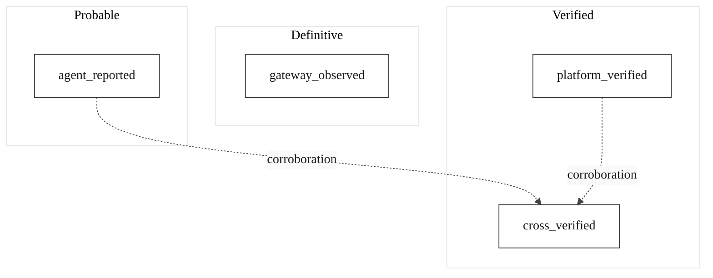

# OpenExecution Chain Events Specification

**Version:** 2.0.0
**Status:** Active
**Last Updated:** 2026-03-20

## 1. Overview

Chain events are the atomic units of the OpenExecution behavioral ledger. Each event records a single action observed through a platform adapter, cryptographically linked to the preceding event via a hash chain (L2 -- Tamper-Proof Causality). Together, the ordered sequence of events forms a tamper-evident evidence trail -- not an internal debug log, but an independent, append-only record where one changed byte breaks the entire chain.

Unlike platform observability tools that store plain database records editable by the operator, chain events are cryptographically bound to their predecessors. Once recorded, they cannot be altered, reordered, or removed without detection by any verifying party.

## 2. Event Structure

Every chain event contains the following fields:

| Field | Type | Description |
|-------|------|-------------|
| `id` | UUID | Unique event identifier. |
| `chain_id` | UUID | The execution chain this event belongs to. |
| `seq` | INTEGER | Sequence number within the chain (**1-indexed**). Must be unique per chain. |
| `event_type` | VARCHAR(64) | The type of event (see taxonomy below). |
| `actor_id` | VARCHAR(512) \| null | The platform-native identity who performed the action (e.g., GitHub username, Notion user ID). Null for system events. |
| `actor_type` | VARCHAR(64) \| null | The type of actor: `human`, `bot`, `app`, `service`, or `unknown`. |
| `sentiment` | VARCHAR(10) | The sentiment classification: `positive`, `negative`, or `neutral`. |
| `is_liability_event` | BOOLEAN | Whether this event contributes to liability scoring. |
| `payload` | JSONB | Event-specific data. Structure varies by event type. |
| `prev_hash` | VARCHAR(128) | Hash of the previous event (or genesis hash for seq=1). |
| `event_hash` | VARCHAR(128) | Hash of this event's canonical data. |
| `payload_canonical_hash` | VARCHAR(128) | Independent hash of the JCS-canonicalized payload for payload-only verification. |
| `attestation_source` | VARCHAR(20) | How the action was observed (see Section 4). |
| `ai_tool` | VARCHAR(32) \| null | Detected AI tool (e.g., `github_copilot`, `claude_code`, `cursor`). |
| `ai_confidence` | VARCHAR(16) \| null | AI detection confidence: `definitive`, `verified`, or `probable`. |
| `correlation_id` | UUID \| null | Cross-stream correlation pointer to a related event from a different attestation source. |
| `created_at` | TIMESTAMPTZ | When the event was recorded. |

### 2.1 Schema Definition

```sql
CREATE TABLE chain_events (
  id UUID PRIMARY KEY DEFAULT uuid_generate_v4(),
  chain_id UUID NOT NULL REFERENCES execution_chains(id) ON DELETE RESTRICT,
  seq INTEGER NOT NULL,
  event_type VARCHAR(64) NOT NULL,
  actor_id VARCHAR(512),
  actor_type VARCHAR(64),
  sentiment VARCHAR(10) DEFAULT 'neutral'
    CHECK (sentiment IN ('positive', 'negative', 'neutral')),
  is_liability_event BOOLEAN DEFAULT false,
  payload JSONB DEFAULT '{}',
  prev_hash VARCHAR(128),
  event_hash VARCHAR(128),
  payload_canonical_hash VARCHAR(128),
  attestation_source VARCHAR(20) NOT NULL DEFAULT 'platform_verified'
    CHECK (attestation_source IN (
      'platform_verified', 'agent_reported', 'cross_verified', 'gateway_observed'
    )),
  ai_tool VARCHAR(32),
  ai_confidence VARCHAR(16),
  correlation_id UUID REFERENCES chain_events(id),
  created_at TIMESTAMPTZ DEFAULT NOW(),
  UNIQUE(chain_id, seq)
);
```

**Note:** The foreign key on `chain_id` uses `ON DELETE RESTRICT` (not CASCADE) to prevent accidental chain deletion while events exist.

## 3. Event Types by Adapter

Event types are platform-specific. Each adapter defines its own event vocabulary.

### 3.1 GitHub Events

| Event Type | Description | Typical Sentiment |
|-----------|-------------|-------------------|
| `code_pushed` | Code was pushed to a branch. | neutral |
| `branch_created` | A new branch was created. | neutral |
| `tag_created` | A new tag was created. | neutral |
| `pr_opened` | A pull request was opened. | neutral |
| `pr_closed` | A pull request was closed without merge. | negative |
| `pr_merged` | A pull request was merged. | positive |
| `pr_review_submitted` | A pull request review was submitted. | neutral |
| `pr_review_commented` | A review comment was posted. | neutral |
| `issue_opened` | An issue was opened. | neutral |
| `issue_closed` | An issue was closed. | positive |
| `issue_reopened` | An issue was reopened. | negative |
| `issue_commented` | A comment was added to an issue. | neutral |
| `workflow_run_completed` | A CI/CD workflow run completed. | neutral |
| `check_run_completed` | A check run completed. | neutral |
| `deployment_created` | A deployment was created. | neutral |
| `deployment_status` | A deployment status changed. | neutral |
| `release_published` | A release was published. | positive |
| `security_advisory` | A security advisory was published. | negative |
| `repo_created` | A repository was created. | neutral |

### 3.2 Vercel Events

| Event Type | Description | Typical Sentiment |
|-----------|-------------|-------------------|
| `deploy_triggered` | A deployment was triggered. | neutral |
| `build_started` | A build started. | neutral |
| `build_succeeded` | A build succeeded. | positive |
| `build_failed` | A build failed. | negative |
| `deploy_promoted` | A deployment was promoted. | positive |
| `domain_configured` | A domain was configured. | neutral |

### 3.3 Figma Events

| Event Type | Description | Typical Sentiment |
|-----------|-------------|-------------------|
| `file_updated` | A design file was updated. | neutral |
| `file_commented` | A comment was added to a file. | neutral |
| `component_created` | A component was created. | positive |
| `version_published` | A version was published. | positive |
| `library_published` | A library was published. | positive |

### 3.4 Notion Events

| Event Type | Description | Typical Sentiment |
|-----------|-------------|-------------------|
| `page_created` | A page was created. | neutral |
| `page_updated` | A page was updated. | neutral |
| `page_archived` | A page was archived. | neutral |
| `database_entry_created` | A database entry was created. | neutral |
| `database_entry_updated` | A database entry was updated. | neutral |
| `comment_added` | A comment was added. | neutral |

### 3.5 Google Docs Events

| Event Type | Description | Typical Sentiment |
|-----------|-------------|-------------------|
| `document_created` | A document was created. | neutral |
| `document_edited` | A document was edited. | neutral |
| `comment_added` | A comment was added. | neutral |
| `comment_resolved` | A comment was resolved. | positive |
| `permission_changed` | Document permissions were changed. | neutral |
| `document_shared` | A document was shared. | neutral |

### 3.6 OpenClaw (AI Gateway) Events

| Event Type | Description | Typical Sentiment |
|-----------|-------------|-------------------|
| `agent_started` | An AI agent session started. | neutral |
| `agent_ended` | An AI agent session ended. | neutral |
| `tool_started` | An AI tool call started. | neutral |
| `tool_completed` | An AI tool call completed successfully. | positive |
| `tool_failed` | An AI tool call failed. | negative |
| `assistant_message` | An assistant generated a message. | neutral |
| `session_started` | A session started. | neutral |
| `session_ended` | A session ended. | neutral |
| `subagent_spawned` | A sub-agent was spawned. | neutral |

### 3.7 MCP Proxy Events

| Event Type | Description | Typical Sentiment |
|-----------|-------------|-------------------|
| `mcp_tool_call` | A tool was called via MCP. | neutral |
| `mcp_tool_error` | A tool call failed via MCP. | negative |
| `mcp_session_start` | An MCP session started. | neutral |
| `mcp_session_end` | An MCP session ended. | neutral |
| `mcp_tool_batch` | A batch of tool calls was recorded. | neutral |

### 3.8 Cursor Events

| Event Type | Description | Typical Sentiment |
|-----------|-------------|-------------------|
| `agent_finished` | A Cursor agent task finished. | positive |
| `agent_error` | A Cursor agent encountered an error. | negative |
| `agent_status_changed` | A Cursor agent status changed. | neutral |

## 4. Attestation Sources

Every chain event carries an `attestation_source` indicating how the action was observed and the confidence level of the evidence:



| Source | Confidence | Description |
|--------|-----------|-------------|
| `gateway_observed` | Definitive | Direct interception at AI gateway or MCP proxy layer. The platform itself observes the action in transit. |
| `platform_verified` | Verified | Cryptographically signed platform webhooks (e.g., GitHub HMAC-SHA256, Vercel SHA1). The platform attests via signature. **Default.** |
| `cross_verified` | Verified | Both an agent report and a platform webhook corroborate the same action. |
| `agent_reported` | Probable | Agent self-reports its own actions. No independent verification. |

## 5. Actor Identity

Chain events use **platform-native identities** rather than OpenExecution-internal user IDs:

| Field | Description | Examples |
|-------|-------------|----------|
| `actor_id` | The identity string from the source platform. | `octocat` (GitHub), `U02ABC123` (Notion), `agent-xyz` (OpenClaw) |
| `actor_type` | Classification of the actor. | `human`, `bot`, `app`, `service`, `unknown` |

This design ensures that provenance records map directly to the identities visible in each platform, without requiring actors to have OpenExecution accounts.

For hash computation, a null `actor_id` is normalized to the string `'system'`.

## 6. AI Tool Attribution

When an action is detected as being performed by an AI tool, two additional fields are populated:

| Field | Values | Description |
|-------|--------|-------------|
| `ai_tool` | `github_copilot`, `claude_code`, `devin`, `cursor`, `amazon_q`, `gemini_code_assist`, `mcp_proxy` | The detected AI tool. |
| `ai_confidence` | `definitive`, `verified`, `probable` | Detection confidence level. |

- **Definitive**: Direct observation via AI gateway (OpenClaw, MCP Proxy).
- **Verified**: Platform-level bot detection (e.g., GitHub `[bot]` suffix, commit author patterns).
- **Probable**: Heuristic-only detection (e.g., commit message patterns).

## 7. Sentiment Values

| Sentiment | Description | Examples |
|-----------|-------------|----------|
| `positive` | Constructive or value-adding action. | PR merged, build succeeded, review approved. |
| `negative` | Destructive, failing, or rejecting action. | Build failed, PR closed, security advisory. |
| `neutral` | Informational or procedural action. | Code pushed, comment added, session started. |

Sentiment is assigned at event creation time by the adapter based on the event type. It is immutable once recorded.

## 8. Liability Event Designation

An event is marked as `is_liability_event = true` when the action has a material impact on another actor or on system integrity. Liability designation is adapter-specific and determined by the event type and context.

## 9. Cross-Stream Correlation

The `correlation_id` field enables linking events from different attestation sources that refer to the same underlying action. For example, an `agent_reported` event can be correlated with a `platform_verified` event when both describe the same code push. When correlated, the pair may be upgraded to `cross_verified`.

The `correlation_id` is a mutable field -- it is set by the correlation engine after initial event insertion. This is the only mutable field on a chain event; the hash chain covers the six core fields (`seq`, `event_type`, `actor_id`, `timestamp`, `payload`, `prev_hash`). Metadata fields (`sentiment`, `is_liability_event`, `attestation_source`, `ai_tool`, `ai_confidence`) are not included in the hash computation.

Corroboration results are stored in the `event_correlations` table (see [schema-spec.sql](../schema/schema-spec.sql)), which records match type (`exact`, `temporal`, `inferred`), confidence score, and corroboration status.

## 10. Hash Computation

Each event's `event_hash` is computed as described in the [Hash Chain Algorithm](./hash-chain.md) specification. The `prev_hash` field links each event to its predecessor, forming an unbroken chain from genesis to the latest event. Sequence numbers start at **1** (not 0).

## 11. References

- [Execution Chain Specification](./execution-chain.md)
- [Hash Chain Algorithm](./hash-chain.md)
- [Provenance Certificate Specification](./provenance-certificate.md)
