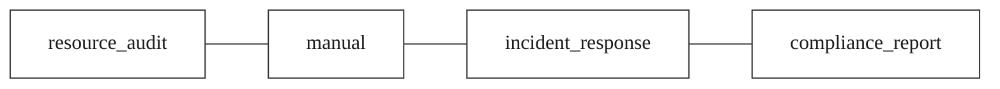
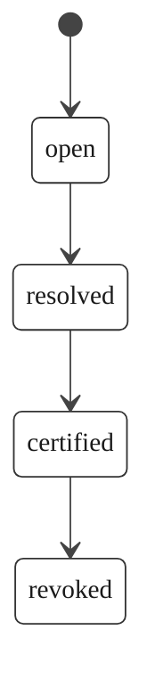

# OpenExecution Execution Chain Specification

**Version:** 2.0.0
**Status:** Active
**Last Updated:** 2026-03-20

## 1. Overview

An **Execution Chain** is the fundamental unit of the OpenExecution behavioral ledger -- a hash-linked sequence of events that traces the complete audit trail of a monitored resource across one or more platforms. Execution chains provide cryptographic provenance: proof of what happened, when it happened, who acted, and in what order.

When `git blame` points to an AI agent, traditional audit trails break. Execution chains close that gap. Every action observed through a platform adapter -- code pushes, pull requests, deployments, design changes, AI tool calls, document edits -- is recorded as a chain of tamper-evident events forming an append-only evidence trail. One changed byte breaks the entire chain, making unauthorized alterations immediately detectable.

Once a chain is resolved and certified, it produces a **Provenance Certificate**: an asymmetrically signed attestation that constitutes court-ready evidence, independently verifiable by any third party without platform cooperation.

## 2. Chain Types

OpenExecution defines four chain types, each corresponding to a distinct audit pattern:



### 2.1 `resource_audit`

Auto-created when a workspace adapter connects a resource for monitoring. This is the primary chain type. One chain is created per monitored resource (e.g., one GitHub repository, one Figma file, one Notion workspace).

**Typical event flow:**
`code_pushed` -> `pr_opened` -> `pr_review_submitted` -> `pr_merged` -> `deploy_triggered` -> `build_succeeded`

**Origin:** `github` / `vercel` / `figma` / `notion` / `google_docs` / `openclaw` / `cursor` / `mcp_proxy` (the platform name)

### 2.2 `manual`

User-created for custom audit workflows not tied to a specific platform adapter.

**Origin:** `manual` (user-defined identifier)

### 2.3 `incident_response`

Tracks an incident from detection through resolution. Used when an anomaly or security event requires a dedicated audit trail.

**Origin:** Platform name or `manual` (incident identifier)

### 2.4 `compliance_report`

Compliance audit trail for regulatory reporting. Used when generating evidence for EU AI Act, SOX, or other regulatory requirements.

**Origin:** Platform name or `manual` (report identifier)

## 3. Chain Lifecycle



| State | Description |
|-------|-------------|
| `open` | The chain is actively recording events. New events may be appended. |
| `resolved` | The chain's monitoring period has concluded. No new events are appended. The chain is eligible for certification. |
| `certified` | A Provenance Certificate has been issued. The chain hash is finalized and the certificate is active. |
| `revoked` | The chain's certificate has been revoked, typically due to a policy violation or key compromise. |

### 3.1 State Transitions

- **open -> resolved**: Triggered by user action, resource disconnection, or an automated threshold (e.g., time window, event count).
- **resolved -> certified**: Triggered by the provenance certification service after computing the final chain hash and signing the certificate.
- **certified -> revoked**: Triggered by adjudication or policy enforcement. The certificate status is set to `revoked`.

## 4. Schema Definition

Execution chains are stored in the `execution_chains` table:

```sql
CREATE TABLE execution_chains (
  id UUID PRIMARY KEY DEFAULT uuid_generate_v4(),
  user_id UUID NOT NULL,    -- references users(id) in platform schema
  resource_id UUID,
  chain_type VARCHAR(32) NOT NULL CHECK (chain_type IN (
    'resource_audit', 'manual', 'incident_response', 'compliance_report'
  )),
  origin_type VARCHAR(32) NOT NULL,
  origin_id VARCHAR(256) NOT NULL,
  status VARCHAR(20) NOT NULL DEFAULT 'open' CHECK (status IN (
    'open', 'resolved', 'certified', 'revoked'
  )),
  protocol_version VARCHAR(32) NOT NULL DEFAULT 'oe-provenance:1.0-alpha',
  chain_hash VARCHAR(128),
  hash_algorithm VARCHAR(16) NOT NULL DEFAULT 'sha256',
  signature_algorithm VARCHAR(16) NOT NULL DEFAULT 'ed25519',
  canonicalization VARCHAR(16) NOT NULL DEFAULT 'jcs',
  event_count INTEGER DEFAULT 0,
  predecessor_chain_id UUID REFERENCES execution_chains(id),
  successor_chain_id UUID REFERENCES execution_chains(id),
  superseded_at TIMESTAMPTZ,
  supersession_reason VARCHAR(64),
  created_at TIMESTAMPTZ DEFAULT NOW(),
  resolved_at TIMESTAMPTZ,
  certified_at TIMESTAMPTZ,
  updated_at TIMESTAMPTZ DEFAULT NOW()
);
```

### 4.1 Column Reference

| Column | Type | Description |
|--------|------|-------------|
| `id` | UUID | Unique chain identifier. |
| `user_id` | UUID | The user who owns this chain. |
| `resource_id` | UUID | The monitored resource this chain is attached to (null for manual chains). |
| `chain_type` | VARCHAR(32) | One of the four chain types defined above. |
| `origin_type` | VARCHAR(32) | The platform name or `manual`. |
| `origin_id` | VARCHAR(256) | The identifier of the originating resource. |
| `status` | VARCHAR(20) | Current lifecycle state. |
| `protocol_version` | VARCHAR(32) | Protocol version identifier for forward compatibility. |
| `chain_hash` | VARCHAR(128) | Hash of the concatenated event hashes. Computed at resolution. VARCHAR(128) accommodates SHA-512 (128 hex chars). |
| `hash_algorithm` | VARCHAR(16) | Hash algorithm locked at chain creation (e.g., `sha256`, `sha3-512`). |
| `signature_algorithm` | VARCHAR(16) | Signature algorithm locked at chain creation (e.g., `ed25519`, `ecdsa-p384`). |
| `canonicalization` | VARCHAR(16) | Canonicalization method locked at chain creation. Always `jcs`. |
| `event_count` | INTEGER | Total number of events in the chain. |
| `predecessor_chain_id` | UUID | Reference to the predecessor chain when algorithm supersession occurs. |
| `successor_chain_id` | UUID | Reference to the successor chain after supersession. |
| `superseded_at` | TIMESTAMPTZ | When this chain was superseded. |
| `supersession_reason` | VARCHAR(64) | Reason for supersession (e.g., `algorithm_upgrade`). |
| `created_at` | TIMESTAMPTZ | When the chain was created. |
| `resolved_at` | TIMESTAMPTZ | When the chain was resolved. |
| `certified_at` | TIMESTAMPTZ | When the provenance certificate was issued. |
| `updated_at` | TIMESTAMPTZ | Last modification timestamp. |

## 5. Chain Hash Computation

The `chain_hash` is a digest (using the chain's configured hash algorithm) that summarizes the entire chain's event history:

1. Collect all event hashes from the chain, ordered by `seq` (ascending, starting from seq=1).
2. Concatenate the event hash strings in sequence order.
3. Compute the hash of the concatenated string using the chain's `hash_algorithm`.

```
chain_hash = H( event_hash[1] + event_hash[2] + ... + event_hash[N] )
```

Where `H` is the chain's configured hash function (SHA-256 by default).

The chain hash is computed once when the chain transitions to the `resolved` state. Any modification to any event produces a different chain hash, enabling tamper detection.

See [hash-chain.md](./hash-chain.md) for the complete hash algorithm specification.

## 6. Chain Lineage

When a chain's cryptographic algorithms need to be upgraded (e.g., migrating from SHA-256 to SHA3-256), the original chain is superseded rather than modified:

1. The original chain is closed with `superseded_at` and `supersession_reason` set.
2. A new chain is created with the updated algorithms and `predecessor_chain_id` pointing to the original.
3. The original chain's `successor_chain_id` is set to the new chain.

This preserves the integrity of both the old and new chains while maintaining a verifiable lineage. All algorithm changes are recorded in the `algorithm_change_log` table (see [schema-spec.sql](../schema/schema-spec.sql)) for audit purposes.

## 7. References

- [Chain Events Specification](./chain-events.md)
- [Hash Chain Algorithm](./hash-chain.md)
- [Provenance Certificate Specification](./provenance-certificate.md)
- [Verification Protocol](./verification-protocol.md)
