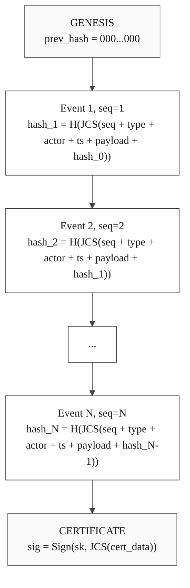

# OpenExecution Hash Chain Algorithm

**Version:** 2.0.0
**Status:** Active
**Last Updated:** 2026-03-20

## 1. Overview

The hash chain algorithm is the cryptographic backbone of the OpenExecution behavioral ledger -- **L2: Tamper-Proof Causality** in the three-layer accountability stack. It ensures that every event in an execution chain is linked to its predecessor via a cryptographic hash, forming a tamper-evident sequence. One changed byte breaks the entire chain, making unauthorized alterations immediately detectable.

This is what separates cryptographic provenance from platform logging. Observability tools store plain database records that the operator can edit at will. A hash chain is append-only by construction: altering any event cascades hash failures through every subsequent event and invalidates the chain hash embedded in the signed Provenance Certificate.

## 2. Genesis Hash

The genesis hash is a fixed sentinel value used as the `prev_hash` for the first event (seq=1) in every chain. Its length matches the output of the chain's configured hash algorithm:

| Hash Algorithm | Genesis Hash Length | Value |
|---------------|--------------------:|-------|
| SHA-256 / SHA3-256 | 64 chars | `'0'.repeat(64)` |
| SHA-384 / SHA3-384 | 96 chars | `'0'.repeat(96)` |
| SHA-512 / SHA3-512 | 128 chars | `'0'.repeat(128)` |

The genesis hash serves as the anchor point for the hash chain.

## 3. Event Hash Computation

Each event's hash is computed using JCS canonicalization (RFC 8785) over a JSON object containing the event's core fields, then hashed with the chain's configured hash algorithm.

### 3.1 Input Object

```javascript
{
  seq: <integer>,           // Event sequence number (1-indexed)
  event_type: <string>,     // Event type identifier
  actor_id: <string>,       // Platform-native actor identity, or 'system' if null
  timestamp: <string>,      // ISO-8601 timestamp (e.g., '2026-03-20T12:00:00.000Z')
  payload: <object>,        // Event payload (JSONB)
  prev_hash: <string>       // Hash of the previous event, or genesis hash for seq=1
}
```

### 3.2 JCS Canonicalization (RFC 8785)

The input object is serialized using the **JSON Canonicalization Scheme (JCS)** defined in RFC 8785. JCS produces a deterministic byte sequence by:

1. **Recursive key sorting**: All object keys at every nesting level are sorted lexicographically.
2. **No whitespace**: No spaces or newlines between tokens.
3. **Deterministic number formatting**: Integers are serialized without decimal points; floats follow ECMAScript NumberToString rules.
4. **Undefined omission**: Keys with `undefined` values are omitted (JSON has no `undefined`).

```javascript
// JCS canonicalization (recursive)
function canonicalize(obj) {
  if (obj === null || obj === undefined) return 'null';
  if (typeof obj !== 'object') return JSON.stringify(obj);
  if (Array.isArray(obj)) {
    return '[' + obj.map(item => canonicalize(item)).join(',') + ']';
  }
  const sortedKeys = Object.keys(obj).sort();
  const pairs = sortedKeys
    .filter(key => obj[key] !== undefined)
    .map(key => JSON.stringify(key) + ':' + canonicalize(obj[key]));
  return '{' + pairs.join(',') + '}';
}
```

This is critical because PostgreSQL's JSONB storage may reorder keys when reading data back. Without canonicalization, a legitimate chain could fail integrity verification due to serialization mismatch.

### 3.3 Hash Computation

```
canonical = JCS(input_object)
event_hash = H(canonical)
```

Where `H` is the chain's configured hash function (SHA-256 by default). The resulting hash is a lowercase hexadecimal string.

### 3.4 Actor ID Normalization

If the event's `actor_id` is `null` (system event), it is normalized to the string `'system'` before hashing:

```javascript
actor_id: event.actor_id || 'system'
```

### 3.5 Timestamp Format

The `timestamp` field must be an ISO-8601 string with millisecond precision and UTC timezone (trailing `Z`), matching the output of JavaScript's `new Date().toISOString()`:

```
YYYY-MM-DDTHH:MM:SS.sssZ
```

## 4. Chain Hash Computation

The chain hash is a single digest that summarizes the entire chain's event history:

### 4.1 Algorithm

1. Collect all event hashes from the chain, ordered by `seq` in ascending order (starting from seq=1).
2. Concatenate the event hash strings (no separator).
3. Compute the hash of the concatenated string using the chain's `hash_algorithm`.

```
chain_hash = H(event_hash[1] + event_hash[2] + ... + event_hash[N])
```

### 4.2 Properties

- The chain hash is computed once when the chain transitions to the `resolved` state.
- It serves as a fingerprint for the entire chain history.
- Any modification to any event in the chain produces a different chain hash.
- The chain hash is included in the Provenance Certificate.

## 5. Hash Chain Structure



## 6. Security Properties

### 6.1 Tamper Detection

If any event in the chain is modified after recording:
- The modified event's `event_hash` will no longer match its recomputed hash.
- All subsequent events' `prev_hash` values will no longer match, cascading the failure through the chain.
- The chain hash will no longer match the stored value.

### 6.2 Ordering Guarantee

The hash chain enforces a strict, immutable ordering of events:
- Each event's hash includes its `seq` number and `prev_hash`.
- Inserting, removing, or reordering events will break the `prev_hash` linkage.
- The sequence is verifiable by any third party with access to the event data.

### 6.3 Non-Repudiation

Each event records the `actor_id` of the actor, and this value is included in the event hash:
- An actor cannot deny having performed an action once it is recorded in a certified chain.
- The `actor_id` is bound to the event hash -- altering it would break the chain.

## 7. Worked Example

### 7.1 Setup

Consider a `resource_audit` chain monitoring a GitHub repository, with hash algorithm SHA-256 and three events:

| seq | event_type | actor_id | timestamp | payload |
|-----|-----------|----------|-----------|---------|
| 1 | `code_pushed` | `octocat` | `2026-03-20T10:00:00.000Z` | `{"ref":"refs/heads/main","commits":1}` |
| 2 | `pr_opened` | `octocat` | `2026-03-20T10:30:00.000Z` | `{"pr_number":42,"title":"Fix bug"}` |
| 3 | `pr_merged` | `maintainer-bot` | `2026-03-20T11:00:00.000Z` | `{"pr_number":42,"merge_sha":"abc123"}` |

### 7.2 Event 1 (First Event)

**Canonical input (JCS — keys sorted):**
```json
{"actor_id":"octocat","event_type":"code_pushed","payload":{"commits":1,"ref":"refs/heads/main"},"prev_hash":"0000000000000000000000000000000000000000000000000000000000000000","seq":1,"timestamp":"2026-03-20T10:00:00.000Z"}
```

**Computation:**
```
event_hash_1 = SHA-256(canonical_input)
```

**Linkage:** `prev_hash = GENESIS_HASH` (the chain starts here)

### 7.3 Event 2

**Canonical input (JCS):**
```json
{"actor_id":"octocat","event_type":"pr_opened","payload":{"pr_number":42,"title":"Fix bug"},"prev_hash":"<event_hash_1>","seq":2,"timestamp":"2026-03-20T10:30:00.000Z"}
```

**Linkage:** `prev_hash = event_hash_1`

### 7.4 Event 3

**Canonical input (JCS):**
```json
{"actor_id":"maintainer-bot","event_type":"pr_merged","payload":{"merge_sha":"abc123","pr_number":42},"prev_hash":"<event_hash_2>","seq":3,"timestamp":"2026-03-20T11:00:00.000Z"}
```

**Linkage:** `prev_hash = event_hash_2`

Note that in each canonical input, the `payload` keys are also sorted (e.g., `commits` before `ref`, `merge_sha` before `pr_number`). This is the recursive sorting behavior of JCS.

### 7.5 Chain Hash

```
chain_hash = SHA-256(event_hash_1 + event_hash_2 + event_hash_3)
```

### 7.6 Verification

To verify this chain:

1. Start with `expected_prev_hash = GENESIS_HASH`.
2. For event 1: Check `prev_hash == GENESIS_HASH`, recompute hash via JCS, check match. Set `expected_prev_hash = event_hash_1`.
3. For event 2: Check `prev_hash == event_hash_1`, recompute hash via JCS, check match. Set `expected_prev_hash = event_hash_2`.
4. For event 3: Check `prev_hash == event_hash_2`, recompute hash via JCS, check match.
5. Concatenate all event hashes, compute hash, compare with stored `chain_hash`.

If all checks pass, the chain is intact and has not been tampered with.

## 8. Implementation Notes

### 8.1 Cross-Platform Compatibility

When implementing the hash chain in different languages:
- Use **JCS canonicalization** (recursive key sorting) -- not naive `JSON.stringify` key order.
- Normalize `actor_id` to `'system'` when null.
- Convert timestamps to ISO-8601 format with millisecond precision and UTC timezone (trailing `Z`).
- Use the platform's native hash implementation for the configured algorithm.
- Sequence numbers start at **1**, not 0.

See the [JavaScript SDK](../sdk/js/) and [Python SDK](../sdk/python/) for reference implementations.

## 9. References

- [Execution Chain Specification](./execution-chain.md)
- [Chain Events Specification](./chain-events.md)
- [Provenance Certificate Specification](./provenance-certificate.md)
- [Verification Protocol](./verification-protocol.md)
