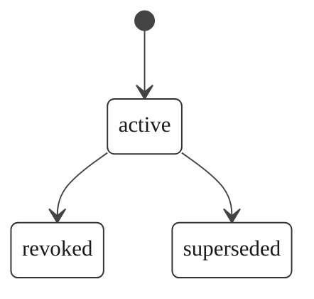

# OpenExecution Provenance Certificate Specification

**Version:** 2.0.0
**Status:** Active
**Last Updated:** 2026-03-20

## 1. Overview

A **Provenance Certificate** is the culmination of the OpenExecution accountability stack -- a signed, self-contained attestation that constitutes court-ready evidence. It proves that a specific artifact was produced through a verified, tamper-evident execution chain, and it can be independently verified by anyone using only the platform's published public key.

This is the key distinction from observability tools like LangSmith, LangFuse, or Helicone: those produce internal debug records that the operator can edit or delete. A Provenance Certificate is cryptographically signed with asymmetric keys (L3 -- Independent Accountability), satisfying eIDAS "advanced electronic signature" requirements and China's Electronic Signature Law (Article 13). Platform logs lie. Cryptography doesn't.

Provenance certificates are issued automatically when an execution chain transitions from the `resolved` state to the `certified` state.

## 2. Certificate Structure

A provenance certificate is stored in the `provenance_certificates` table and contains the following fields:

| Field | Type | Description |
|-------|------|-------------|
| `id` | UUID | Unique certificate identifier. |
| `chain_id` | UUID (UNIQUE) | The execution chain this certificate attests to. One certificate per chain. |
| `user_id` | UUID | The user who owns the chain. |
| `artifact_type` | VARCHAR(64) | The type of artifact being certified. |
| `artifact_ref` | VARCHAR(512) | A reference identifier for the artifact. |
| `artifact_title` | VARCHAR(500) | A human-readable title or description of the certified artifact. |
| `certificate_data` | JSONB | The canonical certificate payload (see Section 3). |
| `chain_hash` | VARCHAR(128) | Hash of the execution chain's concatenated event hashes. |
| `certificate_signature` | VARCHAR(8192) | Digital signature of the canonical `certificate_data`. |
| `signature_algorithm` | VARCHAR(16) | The algorithm used to sign (e.g., `ed25519`, `ecdsa-p521`). |
| `public_key_fingerprint` | VARCHAR(64) | Fingerprint of the public key used for signing, for key rotation tracking. |
| `hash_algorithm` | VARCHAR(16) | The hash algorithm used for the chain (e.g., `sha256`). |
| `canonicalization` | VARCHAR(16) | The canonicalization method (always `jcs`). |
| `status` | VARCHAR(20) | Certificate lifecycle status: `active`, `revoked`, or `superseded`. |
| `revocation_reason` | TEXT | Reason for revocation (null unless revoked). |
| `revoked_at` | TIMESTAMPTZ | When the certificate was revoked (null unless revoked). |
| `superseded_by` | UUID | The certificate that supersedes this one (null unless superseded). |
| `issued_at` | TIMESTAMPTZ | When the certificate was issued. |
| `created_at` | TIMESTAMPTZ | Record creation timestamp. |

## 3. Certificate Data Structure

The `certificate_data` field is a JSON object with the following canonical structure:

```json
{
  "version": "1.0",
  "chain_id": "uuid",
  "chain_type": "resource_audit | manual | incident_response | compliance_report",
  "origin_type": "github | vercel | figma | notion | google_docs | openclaw | cursor | mcp_proxy | manual",
  "origin_id": "string",
  "artifact_type": "string",
  "artifact_ref": "string",
  "artifact_title": "string",
  "event_count": 42,
  "chain_hash": "hex-string",
  "events": [
    {
      "seq": 1,
      "event_type": "code_pushed",
      "actor_id": "octocat",
      "sentiment": "neutral"
    }
  ],
  "chain_created_at": "ISO-8601 timestamp",
  "chain_resolved_at": "ISO-8601 timestamp",
  "issued_at": "ISO-8601 timestamp"
}
```

### 3.1 Event Summary Objects

Each entry in the `events` array is a summary of a chain event:

| Field | Type | Description |
|-------|------|-------------|
| `seq` | integer | Event sequence number within the chain. |
| `event_type` | string | The type of event. |
| `actor_id` | string or null | The platform-native identity who performed the action. |
| `sentiment` | string | The sentiment classification: `positive`, `negative`, or `neutral`. |

## 4. Certificate Signature

The `certificate_signature` field contains a digital signature computed over the JCS-canonicalized representation of the `certificate_data` field.

### 4.1 JCS Canonicalization (RFC 8785)

The certificate data is serialized using JCS canonicalization -- recursive key sorting at every nesting level -- to produce a deterministic byte sequence:

```
canonical = JCS(certificate_data)
```

This ensures that the same logical data always produces the same byte sequence, regardless of the original key ordering. See [hash-chain.md](./hash-chain.md) Section 3.2 for the full JCS algorithm.

### 4.2 Signature Computation

```
signature = Sign(private_key, canonical)
```

Where:
- `private_key` is the platform's signing key (server-side secret).
- `canonical` is the JCS representation of `certificate_data`.
- `Sign` is the chain's configured signature algorithm (Ed25519 by default).
- The output is a hex-encoded string. Length varies by algorithm.

Verification uses only the public key:

```
valid = Verify(public_key, canonical, signature)
```

The platform's public key is available at:

```
GET /api/v1/provenance/public-key
```

### 4.3 Signature Prefix Convention

All OpenExecution provenance signatures use the `oe_sig_` prefix convention when displayed externally:

```
External format: oe_sig_<hex_digest>
Stored format:   <hex_digest>
```

### 4.4 Key Management

- The signing key is asymmetric and never exposed to clients.
- The public key is published at the well-known API endpoint.
- The `public_key_fingerprint` in each certificate enables key rotation tracking.
- Rotated keys produce `superseded` certificates for the old key.
- Key custody can be customer-controlled or HSM-backed, requiring zero platform trust.

## 5. Certificate Status Lifecycle



| Status | Description |
|--------|-------------|
| `active` | The certificate is valid and can be used for verification. |
| `revoked` | The certificate has been revoked. `revocation_reason` and `revoked_at` are set. |
| `superseded` | The certificate has been replaced by a newer certificate. `superseded_by` references the new certificate. |

### 5.1 Status Transitions

- **active -> revoked**: Triggered by adjudication, policy enforcement, or manual revocation. The `revocation_reason` field records the cause.
- **active -> superseded**: Triggered by signing key rotation or certificate reissuance. `superseded_by` points to the new certificate.

Once revoked or superseded, a certificate cannot return to `active`.

## 6. Database Schema

```sql
CREATE TABLE provenance_certificates (
  id UUID PRIMARY KEY DEFAULT uuid_generate_v4(),
  chain_id UUID NOT NULL REFERENCES execution_chains(id) UNIQUE,
  user_id UUID NOT NULL,    -- references users(id) in platform schema
  artifact_type VARCHAR(64) NOT NULL,
  artifact_ref VARCHAR(512) NOT NULL,
  artifact_title VARCHAR(500),
  certificate_data JSONB,
  chain_hash VARCHAR(128),
  certificate_signature VARCHAR(8192),
  signature_algorithm VARCHAR(16) NOT NULL DEFAULT 'ed25519',
  public_key_fingerprint VARCHAR(64),
  hash_algorithm VARCHAR(16) NOT NULL DEFAULT 'sha256',
  canonicalization VARCHAR(16) NOT NULL DEFAULT 'jcs',
  status VARCHAR(20) DEFAULT 'active' CHECK (status IN ('active', 'revoked', 'superseded')),
  revocation_reason TEXT,
  revoked_at TIMESTAMPTZ,
  superseded_by UUID REFERENCES provenance_certificates(id),
  issued_at TIMESTAMPTZ DEFAULT NOW(),
  created_at TIMESTAMPTZ DEFAULT NOW()
);

CREATE INDEX idx_prov_certs_chain ON provenance_certificates(chain_id);
CREATE INDEX idx_prov_certs_user ON provenance_certificates(user_id);
CREATE INDEX idx_prov_certs_artifact ON provenance_certificates(artifact_type, artifact_ref);
CREATE INDEX idx_prov_certs_status ON provenance_certificates(status);
```

## 7. Issuance Process

1. An execution chain transitions to the `resolved` state (chain hash computed).
2. The provenance certification service fetches the chain, its events, and metadata.
3. The service constructs the `certificate_data` JSON object.
4. The service computes the JCS canonical representation.
5. The service computes the digital signature using the platform's private signing key and the chain's `signature_algorithm`.
6. The service inserts the provenance certificate record with status `active`, recording the `public_key_fingerprint`.
7. The execution chain status is updated to `certified` with the `certified_at` timestamp.
8. The certificate is now independently verifiable by any third party.

Only the official OpenExecution platform may issue provenance certificates. See [NOTICE.md](../NOTICE.md) for issuance rights.

## 8. References

- [Execution Chain Specification](./execution-chain.md)
- [Chain Events Specification](./chain-events.md)
- [Hash Chain Algorithm](./hash-chain.md)
- [Verification Protocol](./verification-protocol.md)
