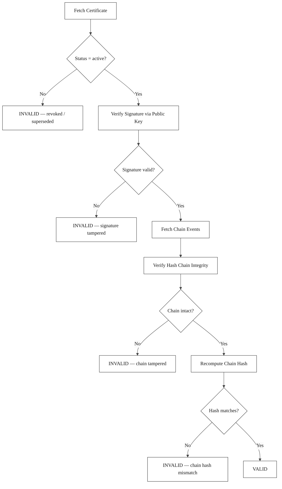

# OpenExecution Verification Protocol

**Version:** 2.0.0
**Status:** Active
**Last Updated:** 2026-03-20

## 1. Overview

The OpenExecution Verification Protocol defines how any third party -- auditors, courts, regulators, counterparties -- can independently verify the authenticity and integrity of a Provenance Certificate without any cooperation from the platform.

This is the protocol that makes OpenExecution fundamentally different from observability tools. LangSmith, LangFuse, and Helicone produce internal records that the operator controls. OpenExecution produces asymmetrically signed certificates verifiable by anyone with the published public key. Platform logs lie. Cryptography doesn't.

Verification can be performed using the public verification API endpoint or offline using the provided SDKs.

The protocol validates three properties:

1. **Signature validity (L3 -- Independent Accountability)** -- the digital signature confirms the certificate data has not been tampered with since issuance, verifiable by anyone with the public key.
2. **Chain hash validity (L2 -- Tamper-Proof Causality)** -- the chain hash in the certificate matches the recomputed hash from the chain's events. One changed byte breaks the entire chain.
3. **Chain integrity (L1 -- Behavior Recording)** -- the hash chain of events is unbroken and each event's hash is correct, proving the complete behavioral record is intact.

## 2. Verification Flow



## 3. Verification Endpoint

```
GET /api/v1/provenance/verify/:certificateId
```

**Parameters:**

| Parameter | Location | Type | Description |
|-----------|----------|------|-------------|
| `certificateId` | path | UUID | The provenance certificate ID to verify. |

**Response:** See Section 7 for the complete response format.

## 4. Verification Steps

### Step 1: Fetch the Certificate

Retrieve the provenance certificate by its ID:

```
GET /api/v1/provenance/verify/{certificateId}
```

If the certificate does not exist, the endpoint returns `404 Not Found`.

### Step 1.5: Check Certificate Status

Verify that the certificate status is `active`. If the certificate has been `revoked` or `superseded`, the verification result is `valid: false` regardless of cryptographic checks.

### Step 2: Verify the Certificate Signature

Verify the digital signature of the `certificate_data` field using the platform's published public key:

1. Extract the `certificate_data` JSON object from the certificate.
2. Serialize it using **JCS canonicalization** (recursive key sorting at every nesting level per RFC 8785).
3. Fetch the platform's public key from `GET /api/v1/provenance/public-key`.
4. Verify the signature using the certificate's `signature_algorithm`.

```
canonical = JCS(certificate_data)
signature_valid = Verify(public_key, canonical, certificate_signature)
```

**Note:** Unlike symmetric signing (HMAC), asymmetric verification requires only the public key. Any third party can perform this step independently.

### Step 3: Fetch Chain Events

Retrieve all chain events for the execution chain referenced by the certificate's `chain_id`. Events must be ordered by `seq` in ascending order (starting from seq=1).

### Step 4: Verify Hash Chain Integrity

Iterate through the chain events in sequence order and verify:

1. **Sequence check:** Events must have consecutive seq numbers starting at 1.
2. **Genesis check:** The first event (seq=1) must have `prev_hash` equal to the genesis hash (all zeros, length matching the chain's hash algorithm).
3. **Linkage check:** For each subsequent event, `prev_hash` must equal the preceding event's `event_hash`.
4. **Hash check:** For each event, recompute the event hash using JCS canonicalization and compare with the stored `event_hash`.

Event hash recomputation:

```
event_data = JCS({
  seq: event.seq,
  event_type: event.event_type,
  actor_id: event.actor_id || 'system',
  timestamp: event.created_at (ISO-8601 with ms precision),
  payload: event.payload,
  prev_hash: event.prev_hash
})

computed_hash = H(event_data)
```

Where `H` is the chain's configured hash algorithm. If any event fails the linkage or hash check, the chain integrity is invalid.

### Step 5: Compute Chain Hash

Compute the chain hash by concatenating all event hashes in sequence order and hashing the result:

```
chain_hash = H(event_hash[1] + event_hash[2] + ... + event_hash[N])
```

### Step 6: Compare Chain Hash

Compare the computed chain hash from Step 5 with the `chain_hash` stored in both the certificate and the execution chain record. All values must match.

### Step 7: Return Verification Result

Assemble the verification result object (see Section 7).

## 5. Verification Decision Matrix

| Signature Valid | Chain Hash Valid | Chain Integrity | Certificate Status | Result |
|:-:|:-:|:-:|:---:|:---:|
| Yes | Yes | Yes | active | **VALID** |
| Yes | Yes | Yes | revoked | **INVALID** (revoked) |
| Yes | Yes | Yes | superseded | **INVALID** (superseded) |
| No | -- | -- | any | **INVALID** (signature tampered) |
| -- | No | -- | any | **INVALID** (chain hash mismatch) |
| -- | -- | No | any | **INVALID** (chain tampered) |

A certificate is considered **VALID** only when all three checks pass and the certificate status is `active`.

## 6. Error Conditions

| Condition | HTTP Status | Error |
|-----------|:-----------:|-------|
| Certificate not found | 404 | `Certificate not found: {certificateId}` |
| Certificate revoked | 200 | Returns result with `valid: false`, `certificate.status: "revoked"` |
| Certificate superseded | 200 | Returns result with `valid: false`, `certificate.status: "superseded"` |
| Chain events missing | 200 | Returns result with `chain_hash_valid: false` |
| Internal error | 500 | `Verification failed: internal error` |

## 7. Response Format

```json
{
  "data": {
    "valid": true,
    "signature_valid": true,
    "chain_hash_valid": true,
    "certificate": {
      "id": "uuid",
      "chain_id": "uuid",
      "artifact_type": "string",
      "artifact_ref": "string",
      "status": "active",
      "signature_algorithm": "ed25519",
      "hash_algorithm": "sha256"
    },
    "chain": {
      "id": "uuid",
      "chain_type": "resource_audit",
      "status": "certified"
    },
    "integrity": {
      "chain_id": "uuid",
      "event_count": 42,
      "is_valid": true,
      "errors": []
    }
  }
}
```

### 7.1 Response Fields

| Field | Type | Description |
|-------|------|-------------|
| `valid` | boolean | Overall verification result. `true` only if all checks pass and certificate is active. |
| `signature_valid` | boolean | Whether the digital signature matches the certificate data. |
| `chain_hash_valid` | boolean | Whether the recomputed chain hash matches the stored chain hash. |
| `certificate` | object | Summary of the certificate being verified. |
| `certificate.signature_algorithm` | string | The signature algorithm used. |
| `certificate.hash_algorithm` | string | The hash algorithm used for the chain. |
| `chain` | object | Summary of the execution chain. |
| `integrity` | object | Chain integrity check results. |
| `integrity.is_valid` | boolean | Whether the hash chain is intact. |
| `integrity.errors` | string[] | Array of error descriptions (empty if valid). |

## 8. Offline Verification

Third-party implementations can perform full cryptographic verification offline using the provided SDKs and the platform's published public key:

- **Chain integrity verification** can be performed entirely offline given the chain events data.
- **Signature verification** requires only the public key (available at the well-known API endpoint and cacheable). No shared secret is needed.
- **Certificate status** must be checked against the live API to confirm the certificate has not been revoked.
- **Bundle verification**: The SDKs support self-contained provenance bundles that include the certificate, chain events, and public key, enabling fully offline verification.

See the [JavaScript SDK](../sdk/js/) and [Python SDK](../sdk/python/) for implementation details.

## 9. References

- [Provenance Certificate Specification](./provenance-certificate.md)
- [Hash Chain Algorithm](./hash-chain.md)
- [Execution Chain Specification](./execution-chain.md)
- [Chain Events Specification](./chain-events.md)
